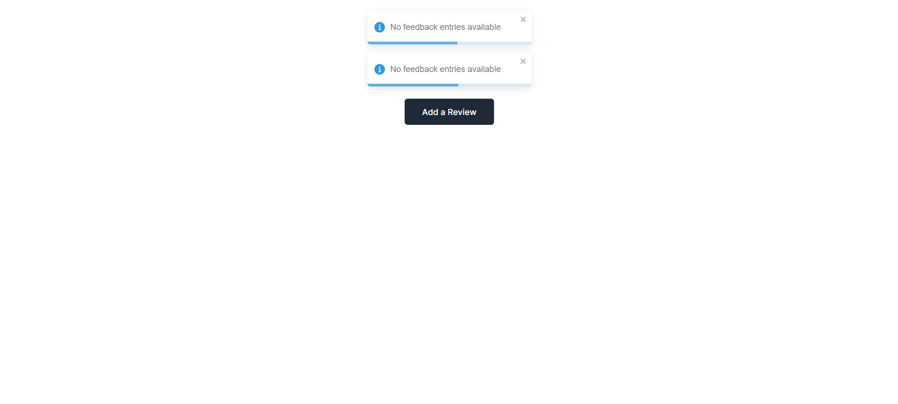
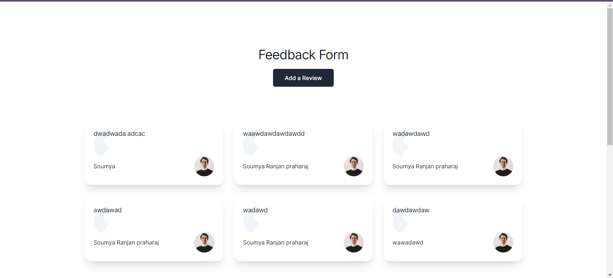

# Feedback App

This project is a simple feedback application built with TypeScript, React, and Next.js. It allows users to submit feedback and view all feedback entries.


## Getting Started

To run this project locally, follow these steps:

1. Clone the repository:

```bash
git clone https://github.com/sonu4435/FullstackIntern1.git
````

2.  Install dependencies:


```bash
cd assignmentintern
npm install
```

3.  Start the development server:


```bash
npm run dev
```

4.  Open your browser and navigate to http://localhost:3000 to view the application.

## Project Structure

The project is built using two parts: Frontend and Backend, both in the same package/directory.

### Frontend (Next.js)

  * **app**: Contains the layout, pages, and necessary backend folders.
  * **components**: There is no component structure as this is a single-page application.
  * **pages**: Contains the main code of the application.
  * **styles**: Uses Tailwind as the default styling.
  * **public**: Contains static assets such as images.
  * **app/index.tsx**: Represents the main page of the React application.

### Backend (Next.js)

  * **route.ts**: Entry point for the Next.js (in-memory) server setup.
  * **Features**:
      * **Rate Limiting**: Implemented based on IP address to prevent spam submissions.
      * **Toast Notifications**: Implemented using the `react-toastify` library for providing visual feedback to users.
      * **Api Communication**: The frontend communicates with the backend API using fetch.

    * **In-Memory Storage**: Feedback entries are stored in-memory on the server.


### Explanation of Additional Features

#### Rate Limiting

Rate limiting based on IP address is implemented to prevent spam submissions. It ensures that a user can only submit feedback once every 10 seconds by tracking the last submission time associated with each IP address.

#### Toast Notifications

Toast notifications are implemented using the `react-toastify` library. They provide visual feedback to the user for actions such as successful feedback submission or error messages. When a user submits feedback successfully, a success toast notification is displayed. In case of an error during feedback submission or fetching, an error toast notification is shown to alert the user. Toast notifications are displayed at the top-center of the application for better visibility and user experience.

### Api Communication

The frontend communicates with the backend API using the `fetch` function, which is a built-in web API provided by modern web browsers. This function allows making HTTP requests to the server and handling the responses asynchronously. In the context of this project, `fetch` is used to send POST requests when submitting new feedback and GET requests when fetching existing feedback entries from the backend.

### In-Memory Storage

In the backend of this project, the feedback entries are stored in-memory on the server. This means that the data is not persisted to any external database or storage system like a database management system (DBMS). Instead, the feedback entries are temporarily stored in the server's memory while the server is running. While this approach simplifies the setup and development process, it also means that the data will be lost when the server is shut down or restarted. For production-grade applications, a more robust data storage solution like a database would typically be used to ensure data persistence and durability.


### Features Not Implemented

  * **Web Worker Integration**: The integration of Web Workers was not implemented due to limited knowledge and lack of prior experience with this technology. Future iterations of the project may explore this feature.
  * **Infinite Scrolling with react-infinite-scroll-component**: Although attempted, the integration of `react-infinite-scroll-component` was not pursued due to its mismatch with the project's design. Alternative solutions for achieving infinite scrolling may be explored in the future.

## Screenshots

### No Data


##
##
### With Data



*Explanation: This screenshot shows how the website looks when there are some feedback entries.*

## Learn More

To learn more about Next.js, take a look at the following resources:

  * **Next.js Documentation:** https://nextjs.org/docs - learn about Next.js features and API.
  * **Learn Next.js:** https://nextjs.org/learn-pages-router/basics/create-nextjs-app - an interactive Next.js tutorial.
